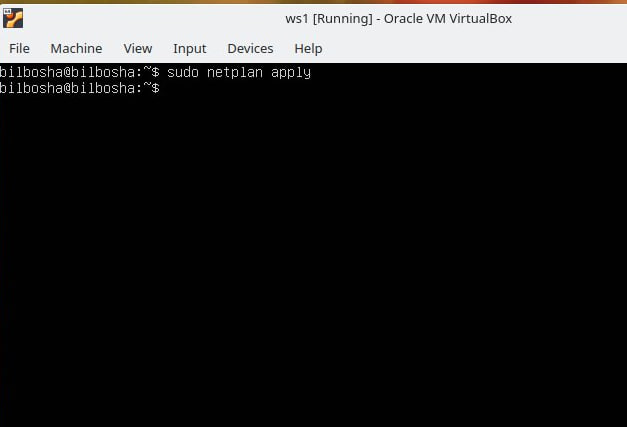

[1-qism. ipcalc asbobi](#1-qism-ipcalc-asbobi)
[2-qism. Ikki qurilma o'rtasida statik marshrutlash](#2-qism-ikki-qurilma-ortasida-statik-marshrutlash)
[3-qism. iperf3 utilitasi](#3-qism-iperf3-utilitasi)
[4-qism. Tarmoq devori](#4-qism-tarmoq-devori)
[5-qism. Statik tarmoq marshrutlash](#5-qism-statik-tarmoq-marshrutlash)
[6-qism. DHCP yordamida dinamik IP sozlamalari](#6-qism-dhcp-yordamida-dinamik-ip-sozlamalari)
[7-qism. NAT](#7-qism-nat)
[8-qism. Qo'shimcha(Bonus). SSH tunnellariga kirish](#8-qism-qoshimchabonus-ssh-tunnellariga-kirish)


## 1-qism. ipcalc asbobi.

### 1.1. Networks and Masks(Tarmoqlar va niqoblar)
`ipcalc o‘rnatish`


**Tarmoq manzili 192.167.38.54/13**


**255.255.255.0 ni prefiks va ikkilik shaklga o‘zgartirish:**

`255:`


`15:`


`11111111.11111111.11111111.11110000:`


**Minimum and maximum host in the network 122.167.38.4 with the following masks:**

`/8:`


`11111111.11111111.00000000.00000000:`


`255.255.254.0:`


`/4:`


### 1.2. localhost

To'g'ri, localhost faqat 127.0.0.1 dan 127.255.255.254 gacha bo'lgan IP manzillarni qabul qiladi.

Mumkin:

127.0.0.2
127.1.0.1
Mumkin emas:

194.34.23.100
128.0.0.1
Chunki localhost faqat 127.0.0.1 — 127.255.255.254 diapazonidagi manzillar uchun ishlaydi.

### 1.3. Network ranges and segments
Xususiy tarmoqlar quyidagi diapazonlarga kiradi:

10.0.0.0 — 10.255.255.255
100.64.0.0 — 100.127.255.255
172.16.0.0 — 172.31.255.255
192.168.0.0 — 192.168.255.255
Qolgan manzillar umumiy (jamoat) sifatida ishlatiladi.

Manzillarni tasniflash:

10.0.0.45 - xususiy
134.43.0.2 - jamoat
192.168.4.2 - xususiy
172.20.250.4 - xususiy
172.0.2.1 - jamoat
192.172.0.1 - jamoat
172.68.0.2 - jamoat
172.16.255.255 - xususiy
10.10.10.10 - xususiy
192.169.168.1 - jamoat
2. IP manzillarni 10.10.0.0/18 tarmog‘i uchun shlyuz sifatida ishlatish

Shlyuz manzili 10.10.0.1 — 10.10.63.254 diapazonida bo‘lishi kerak.

Tasnif:

10.0.0.1 - mos emas
10.10.0.2 - mos
10.10.10.10 - mos
10.10.100.1 - mos emas
10.10.1.255 - mos

## 2-qism. Ikki qurilma o'rtasida statik marshrutlash.

**Ikkita virtual mashina (keyingi o‘rinlarda -- ws1 va ws2)ni ishga tushirish**


ip a buyrug‘i yordamida mavjud tarmoq interfeyslarini ko‘rish


Ikkala mashinada ham ichki tarmoqqa mos keladigan tarmoq interfeysini tavsiflab, quyidagi IP manzillar va niqoblarni o‘rnating:

ws1 - 192.168.100.10, niqob /16
ws2 - 172.24.116.8, niqob /12

ws1:
netplan  o‘zgartirish


O'zgarishlarni saqlash



saqlangandan keyin


ws2:

netplan  o‘zgartirish


O'zgarishlarni saqlash


saqlangandan keyin


## 3-qism. iperf3 utilitasi

### 3.1. Ulanish tezligi
Hisobotga o‘tkazib yozish:

8 Mbps = 1 MB/s (megabit/s dan megabayt/s ga)
100 MB/s = 819200 Kbps (megabayt/s dan kilobit/s ga)
1 Gbps = 1024 Mbps (gigabit/s dan megabit/s ga)

### 3.2. iperf3 utilitasi
ws1 va ws2 o‘rtasidagi ulanish tezligini o‘lchash


## 4-qism. Tarmoq devori

### 4.1. iptables utilitasi
ws1 va ws2 kompyuterlarida faylni yarating: /etc/firewall.sh, bu fayl firewallni imitatsiya qiladi:

Faylga ketma-ket quyidagi qoidalarni qo‘shish kerak:

ws1 da shunday strategiyani qo‘llash kerakki, bunda boshida taqiqlovchi qoida yoziladi, oxirida esa ruxsat beruvchi qoida yoziladi (bu 4 va 5-bandlarga tegishli).

ws2 da shunday strategiyani qo‘llash kerakki, bunda boshida ruxsat beruvchi qoida yoziladi, oxirida esa taqiqlovchi qoida yoziladi (bu 4 va 5-bandlarga tegishli).

Mashinalarda 22-port (SSH) va 80-port (HTTP) uchun kirishni ochish.

echo reply ni taqiqlash (ping qilish mumkin emas, ya'ni OUTPUT’da bloklash bo‘lishi kerak).

echo reply ga ruxsat berish (ping qilish mumkin).


Ikkala mashinada fayllarni quyidagi buyruqlar yordamida ishga tushiring:


`chmod +x /etc/firewall.sh` va `/etc/firewall.sh`


Farqi shundaki, buyruqlar ketma-ket bajariladi. Shuning uchun ws1 da ping taqiqlanadi (chunki ruxsat berish taqiqlashdan keyin qo‘yilgan), ws2 da esa ruxsat beriladi, chunki ruxsat berish birinchi o‘rinda.

### 4.2. nmap utilitasi
ping buyruği bilan ping qilinmayotgan mashinani toping, shundan keyin nmap utilitasi bilan mashina xostining ishga tushganini ko‘rsating. Tekshiruv: nmap chiqishida "Host is up" degan yozuv bo‘lishi kerak.

Hisobotga ping va nmap buyruqlarining chaqirilishi va chiqishini skrinshot qilib qo‘ying.


Virtual mashinalarning tasvirlarini saqlang.


## 5-qism. Statik tarmoq marshrutlash


### 5.1 Uchta ishchi stansiya (ws11, ws21, ws22) va ikkita router (r1, r2) ishga tushiring.

Rasmga muvofiq, mashinalar konfiguratsiyasini /etc/netplan/00-installer-config.yaml faylida sozlang. 


Tarmoq xizmatini qayta ishga tushiring. Agar xato bo‘lmasa, ip -4 a buyrug‘i bilan mashina manzili to‘g‘ri berilganini tekshiring.

Qayta ishga tushirish buyrug‘i:


`sudo systemctl restart NetworkManager`


Shuningdek, ws21 dan ws22 ni ping qiling. Xuddi shunday, ws11 dan r1 ni ping qiling. 


### 5.2. IP manzillarni yo‘naltirishni yoqish
IP manzillarni yo‘naltirishni yoqish uchun routerlarda quyidagi buyruqni bajaring:

`sysctl -w net.ipv4.ip_forward=1`


/etc/sysctl.conf faylini oching va quyidagi satrni qo‘shing:

`net.ipv4.ip_forward = 1`


### 5.3. Default marshrutni o‘rnatish
Ishchi stansiyalar uchun default marshrutni (gateway) sozlang. Buning uchun konfiguratsiya faylida router IP-manzilidan oldin default ni qo‘shing. 


ip r buyrug‘ini chaqirib, marshrutlash jadvaliga marshrut qo‘shilganini ko‘rsating. 


ws11 dan r2 routerni ping qiling va r2 da ping yetib borayotganini ko‘rsating. Buning uchun quyidagi buyruqdan foydalaning:


`tcpdump -tn -i eth1`


### 5.4. Statik marshrutlarni qo‘shish
Routerlar r1 va r2 ga konfiguratsiya faylida statik marshrutlar qo‘shing. 


ip r buyrug‘ini chaqirib, ikkala routerda marshrutlash jadvallarini ko‘rsating. 


ws11 da quyidagi buyruqlarni bajaring:

`ip r list 10.10.0.0`/[tarmoq maskasi]
`ip r list 0.0.0.0/0`


10.10.0.0/[tarmoq maskasi] uchun 0.0.0.0/0 dan boshqacha marshrut tanlanganini tushuntiring, garchi u default marshrutga kirsa ham:

Birinchisi netplandagi yozuv bilan berilgan va maskasi uzun bo‘lgani uchun tanlangan.

### 5.5. Routerlar ro‘yxatini tuzish
r1 da quyidagi buyruq bilan tarmoq trassasini tahlil qiling:

`tcpdump -tnv -i eth0`


traceroute utilitasi yordamida ws11 dan ws21 gacha bo‘lgan marshrutni aniqlang. 


### 5.6. ICMP protokolidan foydalanish
r1 da eth0 orqali o‘tadigan tarmoq trafigini quyidagi buyruq yordamida ushlang:


`tcpdump -n -i eth0 icmp`
ws11 dan mavjud bo‘lmagan IP-ga (masalan, 10.30.0.111) ping buyrug‘i yuboring:

bash
Copy code
ping -c 1 10.30.0.111


Virtual mashinalarning tasvirlarini saqlang.


## 6-qism. DHCP yordamida dinamik IP sozlamalari

r2 da `/etc/dhcp/dhcpd.conf` faylida DHCP xizmatining konfiguratsiyasini sozlang:

Default marshrutlash manzilini, DNS-server va ichki tarmoq manzilini ko‘rsating. 


`resolv.conf` faylida quyidagini kiriting:


`nameserver 8.8.8.8`


DHCP xizmatini qayta ishga tushirish uchun quyidagi buyrug‘ni bajaring:


`systemctl restart isc-dhcp-server`
ws21 mashinasini reboot buyrug‘i bilan qayta ishga tushiring va ip a buyrug‘i yordamida manzil olinganini ko‘rsating. Shuningdek, ws21 dan ws22 ni ping qiling. 


ws11 da MAC manzilini ko‘rsating, buning uchun /etc/netplan/00-installer-config.yaml fayliga quyidagilarni qo‘shing:


```bash
macaddress: 10:10:10:10:10:BA
dhcp4: true
```


r1 ni r2 ga o‘xshash qilib sozlang, lekin IP manzillarni MAC manziliga qattiq bog‘lab bering (ws11 uchun). Shu kabi testlarni o‘tkazing. 


ws21 da IP manzilni yangilashni so‘rang. 


Virtual mashinalarning tasvirlarini saqlang. 


```bash
sudo dhclient -r   # IP-ni o‘chirish
sudo dhclient -v   # IP-ni qo‘shish
```
## 7-qism. NAT


## 8-qism. Qo'shimcha(Bonus). SSH tunnellariga kirish
